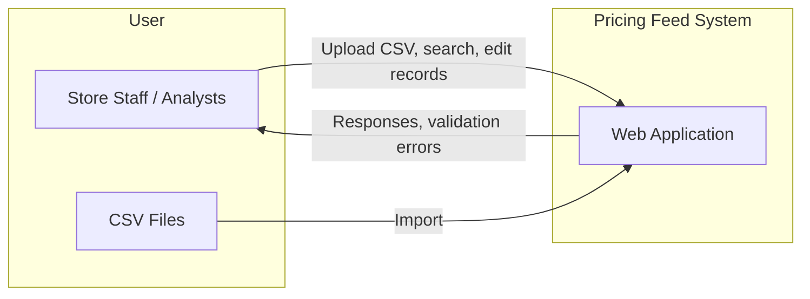

# Context Diagram

```mermaid
flowchart LR
  subgraph external [User]
    User[Store Staff / Analysts]
    CSV[CSV Files]
  end
  
  subgraph system [Pricing Feed System]
    WebApp[Web Application]
  end
  
  User -->|"Upload CSV, search, edit records"| WebApp
  CSV -->|"Import"| WebApp
  WebApp -->|"Responses, validation errors"| User
```

