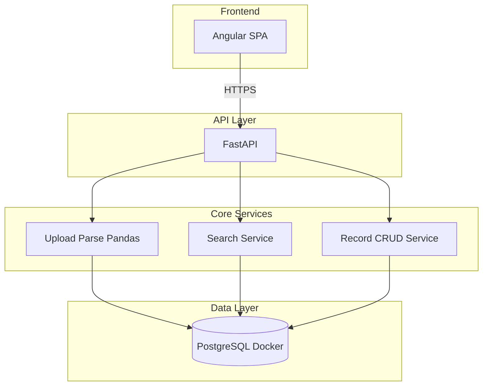

# Solution Architecture

## High-level architecture

- **Frontend**: SPA (Angular) for upload, search, and edit flows.
- **API layer**: REST API (FastAPI) for validation, and routing.
- **Core services**: Upload/parse CSV (Pandas), search with filters, record CRUD.
- **Data layer**: PostgreSQL (Docker for local POC) for persistent pricing records.

## Component view

- **Frontend**: Angular + TypeScript; HttpClient for API; upload UI, search filters, editable model.
- **Backend**: FastAPI; multipart file upload; Pandas for CSV parsing; SQLAlchemy + Alembic; Pydantic for request/response validation.
- **Database**: PostgreSQL in Docker; tables `pricing_feeds`, `uploads`.

## Data flow

- **Upload**: User selects CSV → Angular POST `/api/upload` → Pandas parses and validates → bulk insert via SQLAlchemy → return summary.
- **Search**: Filters → GET `/api/products?…` → Pydantic validates query → SQLAlchemy query → paginated response.
- **Edit**: PATCH `/api/products/:product_id` with body → Pydantic validates → SQLAlchemy update → response schema.
